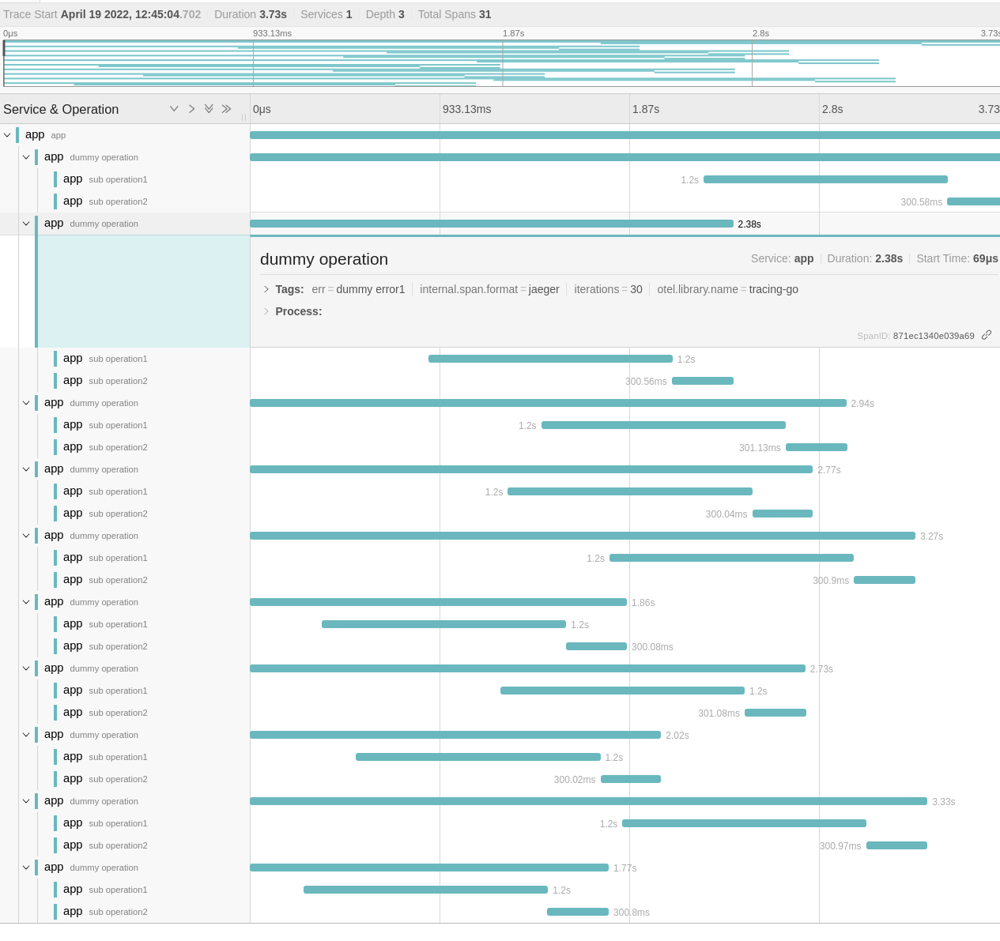

# tracing-go

Pragmatic and minimalistic module for collecting and exporting trace data from the Go code.

> [prometheus/client_golang](https://github.com/prometheus/client_golang) but for Traces

NOTE: This project follows semver, but it is in experimental v0.x.y phase. API might change.

## Background

This library was born from the fact that the current state of Go clients for tracing are far from perfection, especially on simplicity and API front. For now it's meant for demostration purposes on how simple API can be to satisfy most of the tracing needs for the manual instrumentation.

We can take inspiration from the success of the [Prometheus client_golang library](https://github.com/prometheus/client_golang) (package used in more than [51,000 repositories](https://github.com/prometheus/client_golang/network/dependents?package_id=UGFja2FnZS0yMjY0ODEyOTE4)) was in some way thanks to the simplicity, stability and efficiency of that Go client for metrics. Strict compatibility, clear API and error semantics, no scope creep and single module are the things that enabled massive value to so many people and organizations in the community. The key is to make the best user (end developer) experience possible.

The above learnings was what motivated the creation of `github.com/bwplotka/tracing-go`.

## Features

* No global state, only `context` based usage.
* Manual span instrumentation with clear error semantics.
  * You can only create sub-spans from context (only one way of creating spans).
* Export of traces (spans) to the desired tracing backend or collector:
  * Using [gRPC OTLP](https://github.com/open-telemetry/opentelemetry-specification/blob/main/specification/protocol/otlp.md) protocol
  * Using Jaeger Thrift Collector, because Jaeger does [not support OTLP yet](https://github.com/jaegertracing/jaeger/issues/3625) 🙃
  * Writing to file e.g. stdout/stderr.

This project wraps [multiple https://github.com/open-telemetry/opentelemetry-go](https://github.com/open-telemetry/opentelemetry-go) modules, (almost) fully hiding those from the public interface. Yet, if you import `github.com/bwplotka/tracing-go` module you will transiently import OpenTelemetry modules.

## Usage

First, create tracer with exporter(s) you want e.g. Jaeger HTTP Thrift.

```go
// import "github.com/bwplotka/tracing-go/tracing"
// import "github.com/bwplotka/tracing-go/tracing/exporters/jaeger"

tr, closeFn, err := tracing.NewTracer(jaeger.Exporter(jaegerEndpoint), tracing.WithServiceName("app"))
if err != nil {
	// Handle err...
}

defer closeFn()
```

Then use it to create root span that also gives context that can be used to create more sub-spans. 
NOTE: Only context has power to create sub spans.

```go
// import "github.com/bwplotka/tracing-go/tracing"

ctx, root := tr.StartSpan("app")
defer root.End(nil)

// ...
ctx, span := tracing.StartSpan(ctx, "dummy operation")
defer func() {
	span.End(err)
}()
```

Use `DoInSpan` if you want to do something in the dedicated span. 

```go
// import "github.com/bwplotka/tracing-go/tracing"

ctx, root := tr.StartSpan("app")
defer root.End(nil)

tracing.DoInSpan(ctx, "sub operation1", func(ctx context.Context, span tracing.Span) error {
	// ...
})
tracing.DoInSpan(ctx, "sub operation2", func(ctx context.Context, span tracing.Span) error { 
	// ...
})
```

See (and run if you want) an [example instrumented application](https://github.com/bwplotka/tracing-go/blob/e4932502118d0cf62706a342c04107b0727cd230/tracing/tracing_e2e_test.go#L78) using our docker based [e2e suite](https://github.com/efficientgo/e2e).  

E2e example should sent spans to in-memory Jaeger and present view like this: 



## Credits

* Initial version of this library was written for @AnaisUrlichs and @bwplotka demo of [monitoring Argo Rollout jobs](https://github.com/AnaisUrlichs/observe-argo-rollout/blob/main/app/tracing/tracing.go)
* OpenTelemetry project for providing OTLP trace protocol and Go implementation for writing gRPC OTLP.
